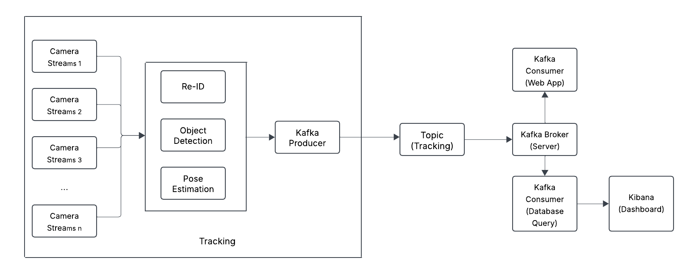

# Real-Time Multi-Camera Object Tracking System
This repository contain Traking module for the project.
Other modules can be found in: https://github.com/tri154/MCMOT_Bigdata
## Overall Pipeline



## Environment Setup
Follow the instructions in the repository to setup environment: https://github.com/ZhenyuX1E/PoseTrack

## Run Tracking:
To run tracking, make sure the Kafka host is runing, this is an example of 2 cameras (currently provied as two videos):
```bash
 python tracking_realtime.py --bootstrap_servers <KAFKA_HOST:PORT> --topic <TOPIC_NAME> --video1 <PATH_VIDEO_CAM1> --video2 <PATH_VIDEO_CAM2> --cal1 <PATH_CALIBRATION_CAM1> --cal2 <PATH_CALIBRATION_CAM1>
```

Here is an example runing on Kaggle: https://www.kaggle.com/code/trikaggle/posetrack-bigdata

## Acknowledgement

Big thanks to the following repo and challenge for sharing such helpful code and datasets:

https://github.com/ZhenyuX1E/PoseTrack

https://www.aicitychallenge.org/2024-ai-city-challenge/